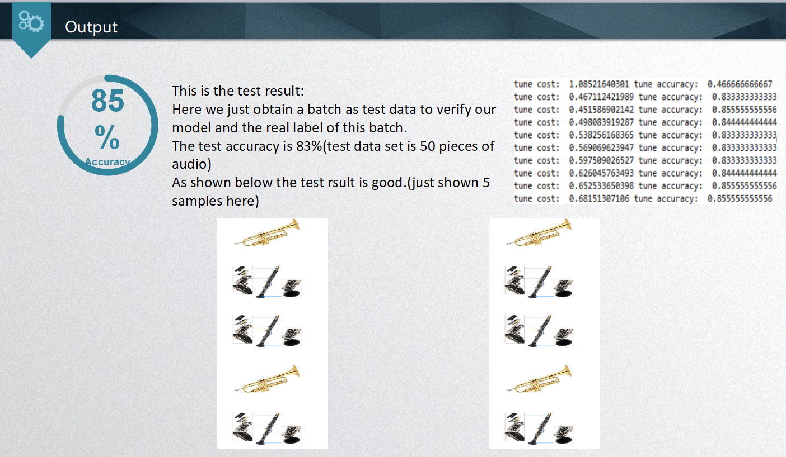

# 
## 目录
* [Background](#background)
* [usage](#usage)
* [content](#content)
    * 普通文本
    * 单行文本
    * 多行文本
    * 文字高亮
    * 换行
    * 斜体
    * 粗体
    * 删除线
* [future work](#future work)

### Background
------

### usage
------

### content
------

### future Work
------

mfcc 对一帧音频数据进行计算，结果会得到一个向量，长度可自由设定，这里用的长度为21
对多个帧的音频数据进行计算，可以得到一组向量，这里用的帧的数量为47

三个txt文件，BbCldat.txt是单簧管，Flutedat.txt是长笛，Trumpetdat.txt是小号
每个文件中，有35列，21行数据
每一列代表一帧音频数据经过 mfcc 后得到的21维向量
mfcc 对一帧音频数据进行计算，结果会得到一个向量，长度可自由设定，这里用的长度为21
对多个帧的音频数据进行计算，可以得到一组向量，这里用的帧的数量为47

三个txt文件，BbCldat.txt是单簧管，Flutedat.txt是长笛，Trumpetdat.txt是小号
每个文件中，有35列，21行数据
每一列代表一帧音频数据经过 mfcc 后得到的21维向量
